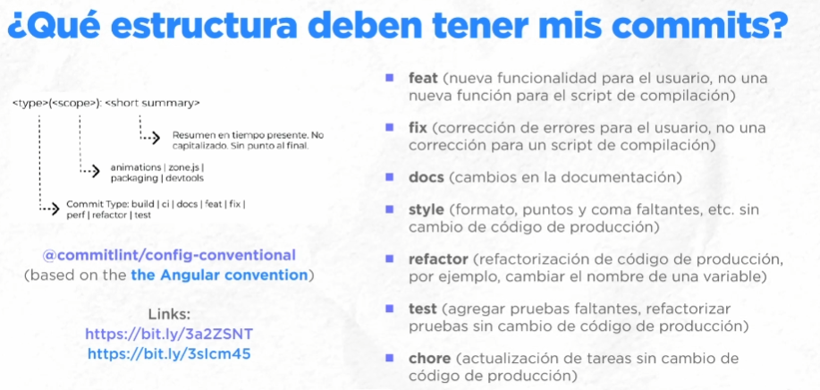

# 1NetzumRepositorio
Primer repositorio creado como prueba de git para el curso de Python de la plataforma Netzum

Modificando el primer repositorio para el curso de Netzum

Otros comandos
1.- git status                      -> me permite ver el estado de sincronización con el repositorio en github
2.- git tag v1.0                    -> se usa generalmente en rama master o main para crer versiones del proyecto

Pasos para actualizar en github mi repositorio
1.- git add .                       -> Se agregan todos los cambios y modificaciones que se hicieron al repositorio en una sola vez
2.- git commit -m 'comentario para identificar ese cambio'
3.- git push origin maim
4.- git pull origin main            -> actualiza todos los cambios del repositorio dremoto al repositorio local

Para cambiarse de ramas
1.- git checkout main                -> salgo de la rama main
2.- git checkout -b nombreRama       -> crea una nueva rama con el nombre que se le  dé y me posiciona en ella.
3.- git add archivoASincronizar.formato    -> agrega para actualizar solo los cambios hechos en el archivo a sicronizar pero en la rama en la que te encuentres
4.- git commit -m "mensaje"
4.- git push origin ramaEnLaQueSeSincronizará  -> sincronizará los cambios en el archivo pero solo para la ramaEnLaQueSeSincronizará

Para actualizar una rama con la información del repositorio remoto o en github
1.- git stash clear
2.- git stash                                -> actualiza los cambios el el repositorio remoto pero twmporalmente
3.- git stash pop                            -> quita los cambios que se hicieron el repositorio remoto en mi 
repositorio local

Generar cambios en commits antes de publicarlos
git commit - m "mensaje"                    ->primer comit hecho per que estuvo ma
git commit --amend -m"new commit"           -> cambiaos el contenido del commit

Revertir cambios, volver a un commit anterior
git log --oneline       -> nos permite ver los commits que se han creado
git revert  0dee494 <- numero del commit

git reset --hard 0dee494   -> quita todos los commits previos al que se ponga en el comando

ESTRUCTURA DE LOS COMMMITS

